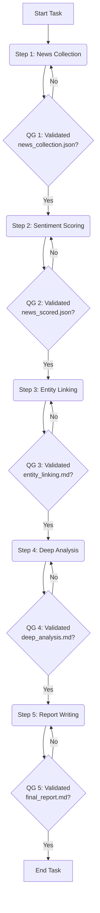

# Master Skill: Securities Sentiment Analysis Pipeline

## 0) Public实例运行约定（CRITICAL）

- 本技能运行在 OpenClaw public 实例，工作区根目录固定为：`/home/ubuntu/.openclaw-public/workspace`。
- 若用户消息包含 `[[OPENCLAW_RUN_ID: <run_id>]]`，所有输出文件必须写入：
  - `/home/ubuntu/.openclaw-public/workspace/<run_id>/`
- 若未提供 run_id，可写入当前工作目录，但优先创建独立子目录避免覆盖。
- 需要检索新闻/网页时：
  - 优先使用 `web_search` 找来源
  - 用 `web_fetch` 抽取正文
  - 不使用不存在的 `search` 工具名

## 1. Overview

This is a **master control skill** that enforces a strict, sequential 5-step workflow for conducting comprehensive securities sentiment analysis. Its primary purpose is to ensure process integrity, prevent missed steps, and guarantee that the final output is built upon a foundation of systematic, verifiable analysis.

**ALWAYS use this skill as the primary guide for any multi-step sentiment analysis request.**

## 2. The 5-Step Workflow (Mandatory & Sequential)

The entire analysis MUST follow these five steps in the exact order listed. **DO NOT skip or reorder steps.** Each step utilizes a dedicated sub-skill and concludes with a mandatory Quality Gate (QG) check before proceeding to the next.

### **Step 1: News Collection**
- **Sub-Skill**: `sentiment-news-collector`
- **Action**: Read the `sentiment-news-collector` skill, gather news from multiple sources, and structure the data.
- **Quality Gate (QG 1)**: Before proceeding, you MUST generate a file named `news_collection.json`. This file must be a JSON array where each object represents a news item and contains at least the following keys: `id`, `date`, `source`, `title`, `summary`, `affected_sectors`, `affected_stocks`.

### **Step 2: Sentiment Scoring**
- **Sub-Skill**: `sentiment-scorer`
- **Action**: Read the `sentiment-scorer` skill, and for each news item in `news_collection.json`, calculate quantitative scores.
- **Quality Gate (QG 2)**: Before proceeding, you MUST generate a new file named `news_scored.json`. This file should be a copy of the previous JSON, with three new keys added to each news object: `sentiment_score` (float, -1.0 to 1.0), `sentiment_heat` (int, 0-100), and `impact_factor` (int, 0-10).

### **Step 3: Entity Linking**
- **Sub-Skill**: `sentiment-entity-linker`
- **Action**: Read the `sentiment-entity-linker` skill. Based on the scored news, identify core entities and establish the causal transmission chain.
- **Quality Gate (QG 3)**: Before proceeding, you MUST generate a Markdown file named `entity_linking.md`. This file MUST define the core entities and clearly delineate the **Tier 1 (Core)**, **Tier 2 (Secondary)**, and **Tier 3 (Thematic)** impact layers, providing the logical basis for each entity's inclusion in a tier.

### **Step 4: Deep Analysis**
- **Sub-Skill**: `sentiment-deep-analyst`
- **Action**: Read the `sentiment-deep-analyst` skill. For representative entities from Tier 1 and Tier 2, conduct a detailed financial elasticity analysis under different scenarios.
- **Quality Gate (QG 4)**: Before proceeding, you MUST generate a Markdown file named `deep_analysis.md`. This file MUST contain scenario definitions (e.g., Pessimistic, Neutral, Optimistic) and include **quantitative financial elasticity tables** for each analyzed entity, projecting changes in revenue, costs, and net profit.

### **Step 5: Report Writing**
- **Sub-Skill**: `sentiment-report-writer`
- **Action**: Read the `sentiment-report-writer` skill. Synthesize all outputs from the previous four steps into a single, cohesive, professional-grade research report.
- **Quality Gate (QG 5)**: Before delivering to the user, you MUST generate the final Markdown file named `final_report.md`. This report must adhere to all structural, content, and compliance requirements outlined in the `sentiment-report-writer` skill. It must integrate the timeline, quantitative scores, tier analysis, and financial projections into a seamless narrative.

## 3. Execution Protocol

1.  At the start of the task, announce that you will be using the `sentiment-analysis-pipeline`.
2.  For each step, explicitly state which step you are beginning.
3.  First, read the `SKILL.md` of the corresponding sub-skill for detailed instructions.
4.  Perform the analysis and generate the required output file.
5.  **Crucially, perform a self-check against the Quality Gate requirements for that step.** State that the QG has been passed.
6.  Announce the completion of the current step and the transition to the next.
7.  After completing Step 5 and passing QG 5, deliver the `final_report.md` and all intermediate output files to the user for full transparency.

## 4. ⚠️ CRITICAL: Error Handling

- If any step fails to produce the required output for its Quality Gate, **you must halt and fix the issue before proceeding.**
- **DO NOT, under any circumstances, proceed to the next step if the current step's QG is not met.** This is the core principle of the pipeline.
- If a sub-skill is missing or fails, report the issue and await guidance. Do not attempt to improvise or skip the step.

## 结尾回执（与前端联动）

- 若存在 run_id，任务结束时在 `/home/ubuntu/.openclaw-public/workspace/<run_id>/.done` 写入 JSON。
- 最少字段：`status`(completed/failed), `run_id`, `skill`, `files`, `file_count`, `summary`, `timestamp`。
- 失败时补充 `error` 字段。
